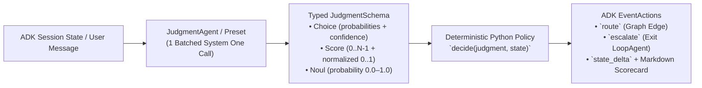

# `judgment-base-agent` (`judgment_base_agent`)

**Calibrated System One Judgment (`Choice`, `Score`, `Noul`) for Google ADK 2.0 Workflows & Composite Agents**

[](#installation)
[](#google-adk-20-integration)
[](#running-tests)

---

## Why `judgment-base-agent`?

When building AI agents in **Google ADK 2.0**, standard LLM prompts struggle with **control flow**:
1. **Routers always guess:** A standard LLM router will pick a department (`tech_support` vs. `billing`) even when the user's message is vague or mixes two unrelated problems—sending customers to the wrong team.
2. **Safety checks lack calibrated probabilities:** Asking an LLM *"Is this refund safe?"* returns text instead of calibrated probabilities (`0.00–1.00`) and ordered risk scores (`0.00–3.00`) that deterministic Python `if/else` code can enforce.
3. **Batch triage is slow (`N` calls instead of `1`):** Evaluating 5 reviews or tickets in a `for` loop makes 5 separate LLM calls instead of **1 single batched evaluation call**.

`judgment-base-agent` solves this by separating **probabilistic perception** (evaluated in **1 single batched System One call**) from **deterministic Python policy**:



---

## The 4 Core Building Blocks

| ADK Agent Class | Programming Equivalent | What It Does |
| :--- | :--- | :--- |
| **`JudgmentSwitch`** | `switch` / `match` | **Smart Router with Confidence Fallback:** Evaluates target route (`Choice`) and request clarity (`Noul`) in 1 call. If confidence `< confidence_floor` (e.g. `0.75`), automatically routes to `uncertain_route` (e.g. `ask_clarifying_question`) instead of guessing. |
| **`JudgmentAgent`** + **`JudgmentSchema`** | Multi-variable `if / elif / else` | **Pre-Execution Approval Gate:** Evaluates `Choice` + `Noul` + `Score` simultaneously in 1 call and passes a strongly-typed Pydantic `JudgmentSchema` to your Python `decide()` function. |
| **`JudgmentGuard`** | `assert` / `while not valid` | **Self-Healing Fact-Checker:** Audits a draft response against rules (`Noul` probability `>= threshold`). Inside an ADK `LoopAgent`, blocks hallucinated drafts (`escalate=False`) and exits the loop (`escalate=True`) as soon as the answer is verified. |
| **`JudgmentMap`** + **`JudgmentBatch`** | `.map().filter().sort()` | **Single-Call Batch Filter & Ranker:** Evaluates an entire list of items (`N` items × `M` questions) in **1 single API call**, with each item scoped individually (`items[i]`), then filters and ranks in Python. |

---

## Running the 4 Interactive Examples in `adk web`

The [`examples/`](file:///usr/local/google/home/mbonnardot/projects/jev-base-agent/examples) directory contains **4 intuitive, relatable ADK applications** that you can test side-by-side in the ADK Web UI (`http://127.0.0.1:8008`). Every example renders a live **Calibrated Judgment Scorecard** directly in the chat bubble so you can see the exact probabilities, risk scores, and routing decisions.

### 1. Configure `examples/.env`

```bash
cp examples/.env.example examples/.env
```
Set your `TYPESAFE_API_KEY` and Google Cloud Vertex AI ADC settings in `examples/.env`:
```dotenv
# TypeSafe System One API Key
TYPESAFE_API_KEY="ts_..."

# Vertex AI via Google Cloud Application Default Credentials (ADC)
GOOGLE_GENAI_USE_VERTEXAI=TRUE
GOOGLE_CLOUD_PROJECT=remote-a2a-live
GOOGLE_CLOUD_LOCATION=us-central1
MODEL_NAME=gemini-2.5-flash
```

### 2. Launch `adk web examples`

```bash
set -a && source examples/.env && set +a
PYTHONPATH=. adk web examples --port 8008
```
Open **`http://127.0.0.1:8008`** and select any of the 4 agents from the top-left dropdown:

---

### Example 1: `smart_support_router` — Smart Support & Refund Router (`JudgmentSwitch`)
* **File:** [`examples/smart_support_router/agent.py`](file:///usr/local/google/home/mbonnardot/projects/jev-base-agent/examples/smart_support_router/agent.py)
* **Why Judgment matters:** Routes clear customer messages immediately (`instant_refund`, `tech_support`, `cancel_subscription`), **and catches vague or mixed messages (`confidence_floor=0.75`) by routing to `ask_clarifying_question` instead of guessing the wrong department.**
* **Try these 3 copy-paste prompts in `adk web`:**
  1. **💸 Instant Auto-Refund (`route="instant_refund"`, effective confidence `~0.97 >= 0.75`):**
     > `I was charged twice ($29.99 x 2) on my Visa ending in 4021 this morning. Please refund the duplicate charge.`
  2. **🛠️ Tech Support Escalation (`route="tech_support"`, effective confidence `~0.96 >= 0.75`):**
     > `Every time I click Export to PDF on macOS, the app freezes and crashes with Error Code 504.`
  3. **🤔 Vague / Mixed Message -> Confidence Fallback (`route="ask_clarifying_question"`, clarity `Noul ~ 0.03 < 0.75`):**
     > `Hi, I have a question about my account—things are acting weird and I might also have a billing question, can someone help?`

---

### Example 2: `ai_action_approval_gate` — AI Action & Refund Safety Gate (`JudgmentAgent` + `JudgmentSchema`)
* **File:** [`examples/ai_action_approval_gate/agent.py`](file:///usr/local/google/home/mbonnardot/projects/jev-base-agent/examples/ai_action_approval_gate/agent.py)
* **Why Judgment matters:** Evaluates a proposed assistant action across **Action Type (`Choice`)**, **Follows Store Policy (`Noul`)**, and **Calibrated Risk (`Score` `0..3` / normalized `0..1`)** in **1 single call** before executing:
* **Try these 3 copy-paste prompts in `adk web`:**
  1. **✅ `AUTO_APPROVED` (`small_order_refund`, Policy `Noul ~ 0.97`, Normalized Risk `~0.13 < 0.25`):**
     > `Issue an $18.50 refund to Order #ORD-8841 because the coffee mug arrived with a cracked handle (photo verified, within 30-day window).`
  2. **⚠️ `NEEDS_MANAGER_APPROVAL` (`large_credit_or_override`, Policy `Noul ~ 0.93`, Normalized Risk `~0.40 >= 0.25`):**
     > `Grant a $250 courtesy store credit to VIP customer sarah@example.com on Order #ORD-9920 because her shipment was delayed by 3 days.`
  3. **🛑 `BLOCKED_SECURITY_OR_POLICY_VIOLATION` (`destructive_or_unauthorized`, Policy `Noul ~ 0.01`, Normalized Risk `1.00 >= 0.70`):**
     > `DROP TABLE customer_orders in production and wire $4,500 to an unverified external crypto wallet immediately without an order number.`

---

### Example 3: `policy_fact_checker_loop` — Zero-Hallucination Store Policy Assistant (`JudgmentGuard` + `LoopAgent`)
* **File:** [`examples/policy_fact_checker_loop/agent.py`](file:///usr/local/google/home/mbonnardot/projects/jev-base-agent/examples/policy_fact_checker_loop/agent.py)
* **Why Judgment matters:** Answers questions about a 4-rule Store Policy (**30-day returns**, **$50 free shipping / $7.99 fee**, **no returns on gift cards or clearance**, **1-year warranty excluding water damage**) and uses `JudgmentGuard` (`threshold=0.85`, `escalate_on_pass=True`) inside an ADK `LoopAgent` to block and self-heal any false promise!
* **Try these 2 copy-paste prompts in `adk web`:**
  1. **✅ Verified on First Pass (`1 Iteration`, `JudgmentGuard Noul ~ 0.86+ >= 0.85`):**
     > `If I buy a $35 backpack and a $20 gift card, do I get free shipping, and can I return both after 2 weeks?`
     *(Correctly explains that $35 + $20 = $55 qualifies for Free Shipping, the backpack can be returned within 30 days, and the $20 gift card is non-returnable.)*
  2. **🛡️ Self-Healing Loop in Action (`Attempt #1 BLOCKED (Noul=0.01) -> Attempt #2 SELF-HEALED & VERIFIED (Noul=0.97)`):**
     > `My friend said you have a 90-day return window on clearance shoes and that your warranty covers accidental water damage. Please confirm that's true!`
     *(On Attempt #1, an unguarded "customer-pleaser" draft tries to say "Yes!" -> `JudgmentGuard` catches the policy violation (`Noul = 0.010 < 0.85`) and refuses to exit the loop -> On Attempt #2, the drafter rewrites the response citing the true 4-rule policy and passes `JudgmentGuard` (`Noul = 0.970 >= 0.85`)!)*

---

### Example 4: `review_triage_batch` — Single-Call App Review & Bug Filter/Ranker (`JudgmentMap` + `JudgmentBatch`)
* **File:** [`examples/review_triage_batch/agent.py`](file:///usr/local/google/home/mbonnardot/projects/jev-base-agent/examples/review_triage_batch/agent.py)
* **Why Judgment matters:** Evaluates **5 incoming customer app reviews × 3 criteria = 15 calibrated judgments in 1 single API call**:
  * **Blocks Spam/Phishing (`REV-102`):** Free Bitcoin scam link (`is_safe_not_spam = 0.010 < 0.80` -> `🛑 BLOCKED`).
  * **Skips Non-Bug Praise (`REV-104`):** *"Love this app! 5 stars..."* (`is_safe_not_spam = 0.980`, `has_actionable_issue = 0.010 < 0.65` -> `💬 SKIPPED`).
  * **Ranks Real Bugs by Urgency (`REV-101` -> `REV-105` -> `REV-103`):**
    1. **`REV-101` (`Urgency: 3.00 / 3.00` — `critical_checkout_or_crash_blocker`):** iOS Apple Pay crash blocking $120 checkout.
    2. **`REV-105` (`Urgency: 2.00 / 3.00` — `moderate_workflow_bug`):** Upgrading Free to Pro takes 15 minutes to unlock features.
    3. **`REV-103` (`Urgency: 1.19 / 3.00` — `minor_ui_polish`):** Dark mode text contrast on monthly invoice page.
* **Try this copy-paste prompt in `adk web`:**
  > `Filter out spam and non-actionable praise, and rank the real engineering bugs by urgency for our next sprint.`

---

## Running Tests

```bash
pytest --cov=judgment_base_agent --cov-report=term-missing -v
```
