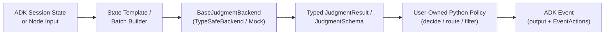

# `judgment-base-agent`

**Calibrated Judgment & Control-Flow Primitives for Google Agent Development Kit (ADK)**

[](https://www.python.org/downloads/)
[](https://google.github.io/adk-docs/)
[](https://github.com/typesafe-ai)
[](#testing--verification)

`judgment-base-agent` is a model-agnostic Python library that integrates calibrated **System One / Judgment models** (such as `model="judgment-latest"` via the TypeSafe SDK) directly into **Google ADK (`google-adk >= 2.7.0`)** applications.

It provides production-ready `BaseAgent` primitives—**`JudgmentAgent`**, **`JudgmentSwitch`**, **`JudgmentGuard`**, and **`JudgmentMap`**—designed to replace fragile, multi-turn LLM prompt-parsing with fast, single-call, confidence-calibrated evaluations across both **ADK 2.0 Graph `Workflow`s** and **ADK Composite Agents** (`SequentialAgent`, `ParallelAgent`, `LoopAgent`).

---

## Table of Contents

1. [Overview & Architecture](#overview--architecture)
2. [Core Design Principles](#core-design-principles)
3. [Installation & Configuration](#installation--configuration)
4. [API Reference](#api-reference)
   - [Question Primitives](#question-primitives)
   - [Calibrated Confidence Tiers](#calibrated-confidence-tiers)
   - [Agent Primitives & Aliases](#agent-primitives--aliases)
5. [Usage Guide](#usage-guide)
   - [1. Multi-Dimensional Evaluation (`JudgmentSchema` & `JudgmentAgent`)](#1-multi-dimensional-evaluation-judgmentschema--judgmentagent)
   - [2. Conditional Routing in ADK 2.0 Graph `Workflow` (`JudgmentSwitch`)](#2-conditional-routing-in-adk-20-graph-workflow-judgmentswitch)
   - [3. Iterative Quality Gating in `LoopAgent` (`JudgmentGuard`)](#3-iterative-quality-gating-in-loopagent-judgmentguard)
   - [4. Single-Call Collection Filtering & Ranking (`JudgmentMap` & `JudgmentBatch`)](#4-single-call-collection-filtering--ranking-judgmentmap--judgmentbatch)
   - [5. Functional Decorator API (`@judgment_node`)](#5-functional-decorator-api-judgment_node)
   - [6. Human-in-the-Loop Escalation (`RequestInput`)](#6-human-in-the-loop-escalation-requestinput)
6. [Deterministic Testing & Custom Backends](#deterministic-testing--custom-backends)
7. [Project Structure](#project-structure)
8. [Testing & Verification](#testing--verification)

---

## Overview & Architecture

In multi-agent systems, routing, guardrails, loop termination, and candidate reranking are **judgment tasks**, not open-ended generation tasks. Using standard generative `LlmAgent` nodes for control flow introduces:

1. **Uncalibrated Decisions:** Generative token probabilities do not reliably reflect epistemic certainty, making it difficult to detect ambiguous inputs and escalate to humans or fallback branches.
2. **Latency & Token Overhead:** Evaluating multiple criteria or scoring a list of `N` retrieved documents often triggers `N` sequential LLM calls.
3. **Control-Flow Coupling:** Prompt logic and routing rules become entangled inside natural-language instructions rather than testable Python code.

`judgment-base-agent` resolves these challenges by separating **calibrated judgment inference** from **deterministic workflow policy**:



Every `judgment-base-agent` primitive subclasses `google.adk.agents.BaseAgent` and emits unified ADK `Event` objects that simultaneously populate:
- **`Event(output=...)`** — Consumed as typed `node_input` by downstream nodes in **ADK 2.0 `Workflow`**.
- **`EventActions(route=..., state_delta=..., escalate=..., transfer_to_agent=...)`** — Consumed by **ADK `Workflow` conditional edges** (`when="..."`) and **ADK Composite Agents** (`SequentialAgent`, `LoopAgent`, `ParallelAgent`).

---

## Core Design Principles

| Principle | Implementation |
| :--- | :--- |
| **Code Owns the Workflow** | Models return typed values and calibrated probabilities (`0.0–1.0`). User-supplied Python functions (`decide`, `route_policy`, `predicate`, `transform`) own all branching, state mutation, and escalation decisions. |
| **Single-Call Batching** | Whether evaluating a 5-field `JudgmentSchema` or scoring 25 candidate items via `JudgmentMap`, all questions are compiled into a **single batched backend call**. |
| **Immutable Data Contracts** | All question definitions (`Noul`, `Kat`, `Skala`, `Nom`), result envelopes (`JudgmentAnswer`, `JudgmentResult`), decisions (`JudgmentDecision`), and batch containers (`JudgmentBatch`) are strictly immutable (`frozen=True`). |
| **Model-Agnostic Extensibility** | All primitives depend on the `@runtime_checkable` `BaseJudgmentBackend` protocol. Use `TypeSafeBackend` (`model="judgment-latest"`) in production, `MockJudgmentBackend` in CI/CD, or plug in a custom calibration backend. |

---

## Installation & Configuration

### Requirements

- Python `>= 3.11`
- `google-adk >= 2.7.0`
- `typesafe-sdk >= 0.2.0`

### Install from Source

```bash
# Standard installation
pip install -e .

# With development and test dependencies
pip install -e ".[dev]"
```

### Environment Setup

`TypeSafeBackend` automatically reads `TYPESAFE_API_KEY` from the environment if no explicit `api_key` or `client` is passed:

```bash
export TYPESAFE_API_KEY="ts_live_..."
```

---

## API Reference

### Question Primitives

All question primitives are imported from `judgment_base_agent` (or alias `judgment_base_agent`) and validated at construction time:

| Primitive | Signature | Output Type | Confidence | Constraints & Behavior |
| :--- | :--- | :---: | :---: | :--- |
| **`Noul`** | `Noul(question: str)` | `bool` | `float` (`0.0–1.0`) | Binary Yes/No judgment with calibrated probability. |
| **`Kat`** | `Kat(question: str, options: Sequence[str])` | `str` | `float` (`0.0–1.0`) | Mutually exclusive classification across **2 to 26** non-empty options. |
| **`Skala`** | `Skala(question: str, low: float = 0.0, high: float = 10.0)` | `float` | `float` (`0.0–1.0`) | Continuous bounded rating (`low < high`) with normalized confidence. |
| **`Nom`** | `Nom(question: str)` | `str` | `None` | Short open-ended text extraction. Returns value only (`ConfidenceTier.NOT_APPLICABLE`). |

---

### Calibrated Confidence Tiers

Every `JudgmentAnswer`, `JudgmentResult`, and `JudgmentSchema` instance computes a `ConfidenceTier` from its calibrated probability:

| Tier | Probability Range | Recommended Policy Action |
| :--- | :---: | :--- |
| `ConfidenceTier.HIGH` | `>= 0.85` | Execute autonomous workflow action immediately. |
| `ConfidenceTier.MODERATE` | `0.70 – 0.84` | Proceed with standard workflow path or log for audit. |
| `ConfidenceTier.LOW` | `0.55 – 0.69` | Trigger secondary verification or conservative fallback route. |
| `ConfidenceTier.UNCERTAIN` | `< 0.55` | Escalate to human-in-the-loop (`RequestInput`) or clarification route. |
| `ConfidenceTier.NOT_APPLICABLE` | `None` | Returned for open-ended `Nom` fields where probability is not applicable. |

---

### Agent Primitives & Aliases

`judgment-base-agent` exports model-agnostic primary classes alongside domain-specific aliases (`SystemOne*`) for team ergonomics:

| Primary Class | SystemOne Alias | Role |
| :--- | :--- | :--- | :--- |
| **`JudgmentAgent`** | `SystemOneAgent` | `SystemOneAgent` | Core `BaseAgent` executing a `JudgmentSchema` or question dictionary and invoking `decide`. |
| **`JudgmentSwitch`** | `SystemOneRouter` (`JudgmentRouter`) | `SystemOneRouter` | Multi-branch conditional router with built-in `confidence_floor` and `uncertain_route` fallback. |
| **`JudgmentGuard`** | `SystemOneGate` (`JudgmentGate`) | `SystemOneGate` | Binary assertion/verification gate supporting `LoopAgent` termination (`escalate_on_pass=True`). |
| **`JudgmentMap`** | — | — | Batched collection operator evaluating an `item_schema` across `N` items in a single backend call. |
| **`@judgment_node`** | — | — | Decorator transforming a typed Python policy function (`(Schema) -> JudgmentDecision`) into a `JudgmentAgent`. |

---

## Usage Guide

### 1. Multi-Dimensional Evaluation (`JudgmentSchema` & `JudgmentAgent`)

Define a declarative `JudgmentSchema` to evaluate multiple heterogeneous questions in a single request. The schema instance passed to your `decide` callback exposes typed attributes (`triage.intent`, `triage.is_urgent`, `triage.severity`) alongside `.confidence(field)` and `.tier(field)` helpers:

```python
from judgment_base_agent import (
    ConfidenceTier,
    JudgmentAgent,
    JudgmentDecision,
    JudgmentField,
    JudgmentSchema,
    Kat,
    Noul,
    Skala,
)


class IncidentTriage(JudgmentSchema):
    category: str = JudgmentField(
        Kat("Classify the incident domain", ["database", "network", "auth", "billing"])
    )
    is_customer_facing: bool = JudgmentField(
        Noul("Does this incident impact production customer traffic?")
    )
    impact_score: float = JudgmentField(
        Skala("Rate customer impact from 0 (none) to 10 (complete outage)", low=0, high=10)
    )


def incident_policy(triage: IncidentTriage) -> JudgmentDecision:
    if triage.tier("category") == ConfidenceTier.UNCERTAIN:
        return JudgmentDecision(route="manual_triage")
    if triage.is_customer_facing and triage.impact_score >= 8.0:
        return JudgmentDecision(
            route="page_oncall",
            state_delta={"priority": "P0"},
        )
    return JudgmentDecision(
        route=f"queue_{triage.category}",
        state_delta={"priority": "P2"},
    )


triage_agent = JudgmentAgent(
    name="incident_triage",
    schema=IncidentTriage,
    state_template="Incident Report:\n{incident_summary}",
    output_key="triage_result",
    decide=incident_policy,
)
```

---

### 2. Conditional Routing in ADK 2.0 Graph `Workflow` (`JudgmentSwitch`)

`JudgmentSwitch` compiles a dictionary of `{route_name: description}` into a categorical `Kat` evaluation and emits `EventActions(route=...)` for ADK 2.0 `Workflow` conditional edges (`when="..."`):

```python
from google.adk.workflow import START, Workflow
from judgment_base_agent import JudgmentSwitch

intent_router = JudgmentSwitch(
    name="intent_router",
    instructions="Select the execution pipeline for the user query",
    routes={
        "sql_analytics": "Requires querying structured warehouse tables",
        "doc_search": "Requires searching internal engineering documentation",
        "direct_reply": "Greeting or general question answerable from context",
    },
    confidence_floor=0.70,
    uncertain_route="clarify_intent",
    state_template="User Query: {user_query}",
    output_key="selected_route",
)

workflow = (
    Workflow(name="enterprise_assistant")
    .add_node(intent_router)
    .add_node(sql_agent)
    .add_node(search_agent)
    .add_node(clarify_agent)
    .add_edge(START, "intent_router")
    .add_edge("intent_router", "sql_agent", when="sql_analytics")
    .add_edge("intent_router", "search_agent", when="doc_search")
    .add_edge("intent_router", "clarify_agent", when="clarify_intent")
)
```

---

### 3. Iterative Quality Gating in `LoopAgent` (`JudgmentGuard`)

`JudgmentGuard` evaluates a binary condition (`Noul`) or custom `predicate`. When configured with `escalate_on_pass=True`, it sets `EventActions(escalate=True)` as soon as the check passes, cleanly terminating an enclosing ADK `LoopAgent`:

```python
from google.adk.agents import LoopAgent, SequentialAgent
from judgment_base_agent import JudgmentGuard

grounding_guard = JudgmentGuard(
    name="grounding_guard",
    question="Is every claim in the draft directly supported by the retrieved context?",
    threshold=0.85,
    pass_route="publish",
    fail_route="revise",
    escalate_on_pass=True,
    state_template="Retrieved Context:\n{context}\n\nDraft Response:\n{draft}",
    output_key="grounding_verdict",
)

synthesis_loop = LoopAgent(
    name="grounded_synthesis_loop",
    sub_agents=[draft_generator_agent, grounding_guard],
    max_iterations=3,
)

pipeline = SequentialAgent(
    name="rag_pipeline",
    sub_agents=[retriever_agent, synthesis_loop],
)
```

---

### 4. Single-Call Collection Filtering & Ranking (`JudgmentMap` & `JudgmentBatch`)

`JudgmentMap` evaluates an `item_schema` across every element of an input sequence in **one batched backend request** (`item_0__field`, `item_1__field`, ...), returning an immutable `JudgmentBatch[TItem, TJudgment]`:

```python
from judgment_base_agent import JudgmentField, JudgmentMap, JudgmentSchema, Noul, Skala


class DocumentAudit(JudgmentSchema):
    is_relevant: bool = JudgmentField(Noul("Does this passage directly answer the user question?"))
    authority_score: float = JudgmentField(Skala("Rate technical depth from 0 to 10", low=0, high=10))


passage_reranker = JudgmentMap(
    name="passage_reranker",
    items_key="retrieved_passages",
    item_template="Question: {user_query}\nPassage: {item}",
    item_schema=DocumentAudit,
    output_key="curated_passages",
    transform=lambda batch: (
        batch.filter(
            lambda entry: entry.judgment.is_relevant
            and entry.confidence("is_relevant") >= 0.75
        )
        .rank_by(lambda entry: entry.judgment.authority_score, reverse=True)
        .items[:5]
    ),
)
```

#### `JudgmentBatch[TItem, TJudgment]` Operations

| Method / Property | Return Type | Description |
| :--- | :--- | :--- |
| `batch.entries` | `tuple[JudgmentBatchEntry, ...]` | Immutable sequence of `(index, item, judgment, raw_result)` entries. |
| `batch.items` | `list[TItem]` | Underlying items in current batch order. |
| `batch.judgments` | `list[TJudgment]` | Instantiated `JudgmentSchema` objects in current batch order. |
| `batch.filter(predicate)` | `JudgmentBatch[TItem, TJudgment]` | Returns a new `JudgmentBatch` retaining entries matching `predicate(entry)`. |
| `batch.rank_by(key_fn, reverse=True)` | `JudgmentBatch[TItem, TJudgment]` | Returns a new `JudgmentBatch` sorted by `key_fn(entry)`. |
| `batch.map(fn)` | `list[R]` | Transforms each `JudgmentBatchEntry` via `fn(entry)`. |
| `batch.all(predicate)` / `batch.any(predicate)` | `bool` | Evaluates boolean quantifiers across all batch entries. |
| `batch.reduce(fn, initial)` | `R` | Folds all batch entries into a single aggregate value. |

---

### 5. Functional Decorator API (`@judgment_node`)

For concise workflow definitions, `@judgment_node` converts a typed Python policy function directly into a `JudgmentAgent` instance:

```python
from judgment_base_agent import JudgmentDecision, JudgmentField, JudgmentSchema, Noul, judgment_node


class ComplianceCheck(JudgmentSchema):
    contains_pii: bool = JudgmentField(Noul("Does the payload contain unmasked PII?"))


@judgment_node(
    name="pii_compliance_node",
    schema=ComplianceCheck,
    state_template="Payload:\n{payload}",
    output_key="compliance",
)
def pii_compliance_node(check: ComplianceCheck) -> JudgmentDecision:
    if check.contains_pii or check.confidence("contains_pii") < 0.80:
        return JudgmentDecision(route="redact_payload")
    return JudgmentDecision(route="approve_payload")
```

---

### 6. Human-in-the-Loop Escalation (`RequestInput`)

When confidence falls into `ConfidenceTier.UNCERTAIN`, your `decide` policy can return an ADK 2.0 `RequestInput` interrupt to pause workflow execution and request human review:

```python
from google.adk.workflow import RequestInput
from judgment_base_agent import ConfidenceTier, JudgmentAgent, JudgmentDecision


def hitl_policy(triage: IncidentTriage) -> JudgmentDecision:
    if triage.tier("category") == ConfidenceTier.UNCERTAIN:
        return JudgmentDecision(
            route="await_human",
            request_input=RequestInput(
                message="Incident category confidence is below threshold (< 0.55). Please confirm category:"
            ),
        )
    return JudgmentDecision(route=f"queue_{triage.category}")
```

---

## Deterministic Testing & Custom Backends

### Unit Testing with `MockJudgmentBackend`

Every agent accepts a `backend` parameter (`BaseJudgmentBackend`). Use `MockJudgmentBackend` to test routing policies, thresholds, and full ADK workflows offline without API keys:

```python
from judgment_base_agent import JudgmentGuard, MockJudgmentBackend

# Static answers: {question_key: (value, confidence)}
mock_backend = MockJudgmentBackend(
    answers={"pass": (True, 0.96)}
)

guard = JudgmentGuard(
    name="safety_gate",
    question="Is the response compliant?",
    threshold=0.85,
    backend=mock_backend,
)
```

`MockJudgmentBackend` also supports dynamic callables `(context, questions) -> Mapping[str, Any]` for stateful or multi-iteration `LoopAgent` tests.

### Implementing a Custom Backend

To integrate an alternative calibration service or local classifier, implement the `BaseJudgmentBackend` protocol:

```python
from typing import Mapping
from judgment_base_agent import BaseJudgmentBackend, JudgmentAnswer, JudgmentQuestion, JudgmentResult


class CustomCalibrationBackend(BaseJudgmentBackend):
    async def evaluate(
        self,
        *,
        context: str,
        questions: Mapping[str, JudgmentQuestion],
        model: str | None = None,
    ) -> JudgmentResult:
        answers = {
            key: JudgmentAnswer(key=key, value=True, confidence=0.92)
            for key in questions
        }
        return JudgmentResult(answers=answers, model=model or "custom-v1")
```

---

## Interactive `adk web` Showcase (`examples/`)

The `examples/` directory contains **4 production-grade ADK applications** that you can inspect and test interactively in Google ADK's browser UI with a single command:

```bash
cp examples/.env.example examples/.env
# Set TYPESAFE_API_KEY and GEMINI_API_KEY in examples/.env
adk web examples
```

Open **`http://localhost:8000`** and select any of the 4 applications from the top-left dropdown:

| Application (`examples/`) | Core Primitive | Architecture & Enterprise Use Case |
| :--- | :--- | :--- |
| **`tool_execution_firewall`** | `JudgmentAgent` + `JudgmentSchema` (`Choice`, `Noul`, `Score`) | **Pre-Execution Blast-Radius & Policy Firewall:** Intercepts proposed SQL/API/wire-transfer tool payloads before execution, evaluates blast radius, policy compliance, and risk exposure in a single Judgment call, and deterministically blocks or allows execution. |
| **`clinical_claims_router`** | `JudgmentSwitch` (`confidence_floor=0.75`) | **Regulated Prior-Authorization Triage (`ADK 2.0 Workflow`):** Routes clinical prior-authorization requests across auto-adjudication, MD peer review, and SIU fraud audit—automatically falling back to `human_clinical_intake` whenever calibrated confidence drops below `0.75`. |
| **`zero_hallucination_rag_loop`** | `JudgmentGuard` (`threshold=0.88`, `escalate_on_pass=True`) | **Self-Healing Covenant & Legal Synthesis (`LoopAgent`):** Iteratively drafts a legal/financial credit memorandum from primary M&A clauses and gates release on calibrated NLI entailment (`>= 0.88`), forcing self-correction until every number and exception is verified. |
| **`security_rfp_evidence_matrix`** | `JudgmentMap` + `JudgmentBatch` | **Single-Call InfoSec RFP Evidence Curation:** Evaluates an entire vault of candidate security artifacts in **one** batched `judgment-latest` call, filters out DLP-unsafe internal runbooks (`safe_for_external_sharing < 0.80`), and ranks approved SOC2/cryptographic specs by authority score. |

### Sample Prompts to Try in `adk web examples`

- **`tool_execution_firewall`**
  - *High-Risk / Blocked:* `"Execute wire transfer of $145,000 to vendor IBAN DE89370400440532013000 and waive dual-control approval for urgent settlement."`
  - *Low-Risk / Autonomous:* `"Run SELECT status, carrier, eta FROM shipments WHERE order_id = 'ORD-99214' for customer support ticket #4412."`
- **`clinical_claims_router`**
  - *Clear Auto-Approve:* `"Prior auth request for CPT 73721 (non-contrast knee MRI) following 8 weeks of documented physical therapy and NSAID failure; X-ray completed 2026-08-02."`
  - *Ambiguous / Confidence Floor Fallback (`< 0.75`):* `"Patient has intermittent discomfort; requesting expedited biologic infusion and out-of-network inpatient stay, chart notes partially illegible."`
- **`zero_hallucination_rag_loop`**
  - `"Draft an executive covenant compliance memo summarizing the Maximum Net Leverage Ratio, the Equity Cure Cap, and the Permitted Acquisition basket."`
- **`security_rfp_evidence_matrix`**
  - `"Prospect RFP Question: Do you support Customer-Managed Encryption Keys (CMEK) with envelope encryption, TLS 1.3 in transit, and zero-retention guarantees for AI inference?"`

---

## Project Structure

```text
judgment-base-agent/
├── judgment_base_agent/
│   └── __init__.py                        # Primary model-agnostic package entrypoint
├── judgment_base_agent/
│   ├── __init__.py                        # Core implementation & public exports
│   ├── agent.py                           # JudgmentAgent(BaseAgent), JudgmentDecision, @judgment_node
│   ├── errors.py                          # JudgmentError hierarchy
│   ├── presets.py                         # JudgmentSwitch, JudgmentGuard, JudgmentMap, JudgmentBatch
│   ├── primitives.py                      # Noul, Kat, Skala, Nom, ConfidenceTier, JudgmentResult
│   ├── schema.py                          # Declarative JudgmentSchema & JudgmentField
│   └── backends/
│       ├── __init__.py
│       ├── base.py                        # BaseJudgmentBackend Protocol
│       ├── mock.py                        # Deterministic MockJudgmentBackend
│       └── typesafe.py                    # AsyncTypeSafe (model="judgment-latest") adapter
├── examples/                              # Interactive `adk web examples` showcase suite
│   ├── tool_execution_firewall/           # JudgmentAgent + JudgmentSchema pre-execution firewall
│   ├── clinical_claims_router/            # ADK 2.0 Graph Workflow + JudgmentSwitch router
│   ├── zero_hallucination_rag_loop/       # ADK LoopAgent + JudgmentGuard self-healing RAG loop
│   └── security_rfp_evidence_matrix/      # JudgmentMap + JudgmentBatch DLP filter & ranker
├── tests/
│   ├── unit/                              # Unit tests for primitives, schemas, backends, agents, presets
│   └── integration/                       # End-to-end ADK 2.0 Workflow, LoopAgent, and `adk web` loader tests
└── pyproject.toml                         # Build configuration & pytest settings
```

---

## Testing & Verification

Run the complete unit and ADK integration test suite with coverage reporting:

```bash
pytest --cov=judgment_base_agent --cov=judgment_base_agent --cov-report=term-missing -v
```

Current test coverage across `judgment_base_agent` / `judgment_base_agent` is **97%** (`25/25` tests passing).
