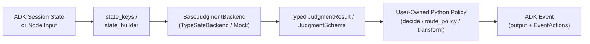

# `judgment-base-agent`

**Calibrated Judgment & Control-Flow Primitives for Google Agent Development Kit (ADK)**

[](https://www.python.org/downloads/)
[](https://google.github.io/adk-docs/)
[](https://github.com/typesafe-ai)
[](#testing--verification)

`judgment-base-agent` (`judgment_base_agent`) is a model-agnostic Python library that integrates calibrated **System One / Judgment models** (`model="judgment-latest"` via the TypeSafe SDK) directly into **Google ADK (`google-adk >= 2.7.0`)** applications.

It provides production-ready `BaseAgent` primitives—**`JudgmentAgent`**, **`JudgmentSwitch`**, **`JudgmentGuard`**, and **`JudgmentMap`**—designed to replace fragile, multi-turn LLM prompt-parsing with fast, single-call, confidence-calibrated evaluations across both **ADK 2.0 Graph `Workflow`s** and **ADK Composite Agents** (`SequentialAgent`, `ParallelAgent`, `LoopAgent`).

---

## Table of Contents

1. [Overview & Architecture](#overview--architecture)
2. [Core Design Principles](#core-design-principles)
3. [Installation & Configuration](#installation--configuration)
4. [Interactive `adk web examples` Showcase](#interactive-adk-web-examples-showcase)
5. [API Reference](#api-reference)
   - [Question Primitives (`Choice`, `Score`, `Noul`)](#question-primitives-choice-score-noul)
   - [Calibrated Confidence Tiers](#calibrated-confidence-tiers)
   - [Agent Primitives & Aliases](#agent-primitives--aliases)
6. [Usage Guide](#usage-guide)
   - [1. Multi-Dimensional Evaluation (`JudgmentSchema` & `JudgmentAgent`)](#1-multi-dimensional-evaluation-judgmentschema--judgmentagent)
   - [2. Conditional Routing in ADK 2.0 Graph `Workflow` (`JudgmentSwitch`)](#2-conditional-routing-in-adk-20-graph-workflow-judgmentswitch)
   - [3. Iterative Quality Gating in `LoopAgent` (`JudgmentGuard`)](#3-iterative-quality-gating-in-loopagent-judgmentguard)
   - [4. Single-Call Collection Filtering & Ranking (`JudgmentMap` & `JudgmentBatch`)](#4-single-call-collection-filtering--ranking-judgmentmap--judgmentbatch)
   - [5. Functional Decorator API (`@judgment_node`)](#5-functional-decorator-api-judgment_node)
   - [6. Human-in-the-Loop Escalation (`RequestInput`)](#6-human-in-the-loop-escalation-requestinput)
7. [Deterministic Testing & Custom Backends](#deterministic-testing--custom-backends)
8. [Project Structure](#project-structure)
9. [Testing & Verification](#testing--verification)

---

## Overview & Architecture

In multi-agent systems, routing, guardrails, loop termination, and candidate reranking are **judgment tasks**, not open-ended generation tasks. Using standard generative `LlmAgent` nodes for control flow introduces:

1. **Uncalibrated Decisions:** Generative token probabilities do not reliably reflect epistemic certainty, making it difficult to detect ambiguous inputs and escalate to humans or fallback branches.
2. **Latency & Token Overhead:** Evaluating multiple criteria or scoring a list of `N` retrieved documents often triggers `N` sequential LLM calls.
3. **Control-Flow Coupling:** Prompt logic and routing rules become entangled inside natural-language instructions rather than testable Python code.

`judgment-base-agent` resolves these challenges by separating **calibrated judgment inference** from **deterministic workflow policy**:



Every `judgment-base-agent` primitive subclasses `google.adk.agents.BaseAgent` and emits unified ADK `Event` objects that simultaneously populate:
- **`Event(output=...)`** — Consumed as typed `node_input` by downstream nodes in **ADK 2.0 `Workflow`**.
- **`EventActions(route=..., state_delta=..., escalate=..., transfer_to_agent=..., request_input=...)`** — Consumed by **ADK `Workflow` conditional edges** (`when="..."`) and **ADK Composite Agents** (`SequentialAgent`, `LoopAgent`, `ParallelAgent`).

---

## Core Design Principles

| Principle | Implementation |
| :--- | :--- |
| **Code Owns the Workflow** | Models return typed values and calibrated probabilities (`0.0–1.0`). User-supplied Python functions (`decide`, `route_policy`, `predicate`, `transform`) own all branching, state mutation, and escalation decisions. |
| **Single-Call Batching** | Whether evaluating a multi-field `JudgmentSchema` or scoring 25 candidate items via `JudgmentMap`, all questions are compiled into a **single batched backend call**. |
| **Immutable Data Contracts** | All question definitions (`Choice`, `Score`, `Noul`), result envelopes (`ChoiceJudgment`, `ScoreJudgment`, `NoulJudgment`, `JudgmentResult`), decisions (`JudgmentDecision`), and batch containers (`JudgmentBatch`) are strictly immutable (`frozen=True`). |
| **Model-Agnostic Extensibility** | All primitives depend on the `@runtime_checkable` `BaseJudgmentBackend` protocol. Use `TypeSafeBackend` (`model="judgment-latest"`) in production, `MockJudgmentBackend` in CI/CD, or plug in a custom calibration backend. |

---

## Installation & Configuration

### Requirements

- Python `>= 3.11`
- `google-adk >= 2.7.0`
- `typesafe-sdk >= 0.2.0`

### Install from Source

```bash
# Standard editable installation
pip install -e .

# With development and test dependencies
pip install -e ".[dev]"
```

### Environment Setup

`TypeSafeBackend` automatically reads `TYPESAFE_API_KEY` from the environment if no explicit `api_key` or `client` is passed:

```bash
export TYPESAFE_API_KEY="ts_live_..."
```

---

## Interactive `adk web examples` Showcase

The [`examples/`](examples/) directory contains **4 production-grade ADK applications** that you can inspect and test interactively in Google ADK's browser UI with a single command.

### 1. Configure Credentials (`examples/.env`)

Copy the example environment file and configure **TypeSafe** alongside either **Google Cloud Application Default Credentials (ADC) / Vertex AI** or a **Gemini API Key**:

```bash
cp examples/.env.example examples/.env
```

**Option A: Google Cloud ADC / Vertex AI (Recommended for Enterprise)**
```bash
gcloud auth application-default login
```
In `examples/.env`:
```dotenv
TYPESAFE_API_KEY="your-typesafe-api-key"
GOOGLE_GENAI_USE_VERTEXAI=TRUE
GOOGLE_CLOUD_PROJECT="your-gcp-project-id"
GOOGLE_CLOUD_LOCATION="us-central1"
MODEL_NAME="gemini-2.5-flash"
```

**Option B: Google AI Studio API Key**
```dotenv
TYPESAFE_API_KEY="your-typesafe-api-key"
GOOGLE_GENAI_USE_VERTEXAI=FALSE
GEMINI_API_KEY="your-gemini-api-key"
MODEL_NAME="gemini-2.5-flash"
```

### 2. Launch `adk web examples`

```bash
adk web examples --port 8008
```

Open **`http://127.0.0.1:8008`** and select any of the 4 applications from the top-left dropdown:

| Application (`examples/`) | Core Primitive | Architecture & Enterprise Use Case |
| :--- | :--- | :--- |
| **`tool_execution_firewall`** | `JudgmentAgent` + `JudgmentSchema` (`Choice`, `Noul`, `Score`) | **Pre-Execution Blast-Radius & Policy Firewall:** Intercepts proposed SQL/API/wire-transfer tool payloads before execution, evaluates blast radius, policy compliance, and risk exposure in a single Judgment call, and deterministically blocks or allows execution. |
| **`clinical_claims_router`** | `JudgmentSwitch` (`confidence_floor=0.75`) | **Regulated Prior-Authorization Triage (`ADK 2.0 Workflow`):** Routes clinical prior-authorization requests across auto-adjudication, MD peer review, and SIU fraud audit—automatically falling back to `human_clinical_intake` whenever calibrated confidence drops below `0.75`. |
| **`zero_hallucination_rag_loop`** | `JudgmentGuard` (`threshold=0.88`, `escalate_on_pass=True`) | **Self-Healing Covenant & Legal Synthesis (`LoopAgent`):** Iteratively drafts a legal/financial credit memorandum from primary M&A clauses and gates release on calibrated NLI entailment (`>= 0.88`), forcing self-correction until every number and exception is verified. |
| **`security_rfp_evidence_matrix`** | `JudgmentMap` + `JudgmentBatch` | **Single-Call InfoSec RFP Evidence Curation:** Evaluates an entire vault of candidate security artifacts in **one** batched `judgment-latest` call, filters out DLP-unsafe internal runbooks (`safe_for_external_sharing < 0.80`), and ranks approved SOC2/cryptographic specs by authority score. |

### Sample Prompts to Try in `adk web examples`

- **`tool_execution_firewall`**
  - *High-Risk / Blocked:* `"Execute wire transfer of $145,000 to vendor IBAN DE89370400440532013000 and waive dual-control approval for urgent settlement."`
  - *Low-Risk / Autonomous:* `"Run SELECT status, carrier, eta FROM shipments WHERE order_id = 'ORD-99214' for customer support ticket #4412."`
- **`clinical_claims_router`**
  - *Clear Auto-Approve:* `"Prior auth request for CPT 73721 (non-contrast knee MRI) following 8 weeks of documented physical therapy and NSAID failure; X-ray completed 2026-08-02."`
  - *Ambiguous / Confidence Floor Fallback (`< 0.75`):* `"Patient has intermittent discomfort; requesting expedited biologic infusion and out-of-network inpatient stay, chart notes partially illegible."`
- **`zero_hallucination_rag_loop`**
  - `"Draft an executive covenant compliance memo summarizing the Maximum Net Leverage Ratio, the Equity Cure Cap, and the Permitted Acquisition basket."`
- **`security_rfp_evidence_matrix`**
  - `"Prospect RFP Question: Do you support Customer-Managed Encryption Keys (CMEK) with envelope encryption, TLS 1.3 in transit, and zero-retention guarantees for AI inference?"`

---

## API Reference

### Question Primitives (`Choice`, `Score`, `Noul`)

All question primitives are imported from `judgment_base_agent` and validated at construction time:

| Primitive | Signature | Result Envelope | Typed Value | Calibrated Metadata |
| :--- | :--- | :--- | :---: | :--- |
| **`Choice`** | `Choice(instructions: str, criteria: Sequence[str] \| Mapping[str, str \| None])` | `ChoiceJudgment` | `str` (`choice`) | `.probabilities: dict[str, float]`, `.confidence: float`, `.tier: ConfidenceTier` |
| **`Score`** | `Score(instructions: str, criteria: Sequence[str] \| Mapping[str, float])` | `ScoreJudgment` | `float` (`score`) | `.legend: dict[str, float]`, `.probabilities: dict[str, float]`, `.confidence: float`, `.tier: ConfidenceTier` |
| **`Noul`** | `Noul(instructions: str, criteria: Mapping[str, str \| None] \| None = None)` | `NoulJudgment` | `float` (`noul`) | `.passed(threshold=0.5) -> bool`, `.confidence: float`, `.tier: ConfidenceTier` |

---

### Calibrated Confidence Tiers

Every `ChoiceJudgment`, `ScoreJudgment`, `NoulJudgment`, `JudgmentResult`, and `JudgmentSchema` instance computes a `ConfidenceTier`:

| Tier | Confidence Range | Recommended Policy Action |
| :--- | :---: | :--- |
| `ConfidenceTier.HIGH` | `>= 0.85` | Execute autonomous workflow action immediately. |
| `ConfidenceTier.MODERATE` | `0.70 – < 0.85` | Proceed with standard workflow path or log for audit. |
| `ConfidenceTier.LOW` | `confidence_floor – < 0.70` | Trigger secondary verification or conservative fallback route. |
| `ConfidenceTier.UNCERTAIN` | `< confidence_floor` (default `0.50`) | Escalate to human-in-the-loop (`RequestInput`) or fallback route. |

---

### Agent Primitives & Aliases

`judgment-base-agent` exports model-agnostic primary classes alongside `SystemOne*` aliases:

| Primary Class | Alias | Role |
| :--- | :--- | :--- |
| **`JudgmentAgent`** | `SystemOneAgent` | Core `BaseAgent` executing a `JudgmentSchema` or question dictionary and invoking `decide`. |
| **`JudgmentSwitch`** | `JudgmentRouter`, `SystemOneRouter` | Multi-branch conditional router with built-in `confidence_floor` and mandatory `uncertain_route` fallback. |
| **`JudgmentGuard`** | `JudgmentGate`, `SystemOneGate` | Binary assertion/verification gate supporting `LoopAgent` termination (`escalate_on_pass=True`). |
| **`JudgmentMap`** | `JudgmentBatch` (container) | Batched collection operator evaluating a schema or question map across `N` items in a single backend call. |
| **`@judgment_node`** | — | Decorator transforming a typed Python policy function (`(Schema, ctx) -> JudgmentDecision`) into a `JudgmentAgent`. |

---

## Usage Guide

### 1. Multi-Dimensional Evaluation (`JudgmentSchema` & `JudgmentAgent`)

Define a declarative `JudgmentSchema` to evaluate multiple heterogeneous questions in a single request. The schema instance passed to your `decide` callback exposes typed attributes (`triage.category`, `triage.is_customer_facing`, `triage.impact_score`) alongside `.confidence(field)` and `.tier(field)` helpers:

```python
from judgment_base_agent import (
    Choice,
    ConfidenceTier,
    JudgmentAgent,
    JudgmentDecision,
    JudgmentSchema,
    Noul,
    Score,
)


class IncidentTriage(JudgmentSchema):
    category: str = Choice(
        instructions="Classify the incident domain",
        criteria=["database", "network", "auth", "billing"],
    )
    is_customer_facing: float = Noul(
        instructions="Does this incident impact production customer traffic?"
    )
    impact_score: float = Score(
        instructions="Rate customer impact from 1 (minimal) to 5 (complete outage)",
        criteria=["minimal", "low", "moderate", "high", "critical_outage"],
    )


def incident_policy(triage: IncidentTriage) -> JudgmentDecision:
    if triage.tier("category") == ConfidenceTier.UNCERTAIN:
        return JudgmentDecision(route="manual_triage")
    if triage.is_customer_facing >= 0.80 and triage.impact_score >= 4.0:
        return JudgmentDecision(
            route="page_oncall",
            state_delta={"priority": "P0"},
        )
    return JudgmentDecision(
        route=f"queue_{triage.category}",
        state_delta={"priority": "P2"},
    )


triage_agent = JudgmentAgent(
    name="incident_triage",
    schema=IncidentTriage,
    state_keys=["incident_summary"],
    output_key="triage_result",
    decide=incident_policy,
)
```

---

### 2. Conditional Routing in ADK 2.0 Graph `Workflow` (`JudgmentSwitch`)

`JudgmentSwitch` compiles a dictionary of `{route_name: description}` into a categorical `Choice` evaluation and emits `EventActions(route=...)` for ADK 2.0 `Workflow` conditional edges (`when="..."`):

```python
from google.adk.workflow import START, Workflow
from judgment_base_agent import JudgmentSwitch

intent_router = JudgmentSwitch(
    name="intent_router",
    instructions="Select the execution pipeline for the user query",
    routes={
        "sql_analytics": "Requires querying structured warehouse tables",
        "doc_search": "Requires searching internal engineering documentation",
        "direct_reply": "Greeting or general question answerable from context",
    },
    confidence_floor=0.75,
    uncertain_route="clarify_intent",
    state_keys=["user_query"],
    output_key="selected_route",
)

workflow = (
    Workflow(name="enterprise_assistant")
    .add_node(intent_router)
    .add_node(sql_agent)
    .add_node(search_agent)
    .add_node(clarify_agent)
    .add_edge(START, "intent_router")
    .add_edge("intent_router", "sql_agent", when="sql_analytics")
    .add_edge("intent_router", "search_agent", when="doc_search")
    .add_edge("intent_router", "clarify_agent", when="clarify_intent")
)
```

---

### 3. Iterative Quality Gating in `LoopAgent` (`JudgmentGuard`)

`JudgmentGuard` evaluates a binary condition (`Noul`) or custom `predicate`. When configured with `escalate_on_pass=True`, it sets `EventActions(escalate=True)` as soon as the check passes, cleanly terminating an enclosing ADK `LoopAgent`:

```python
from google.adk.agents import LoopAgent, SequentialAgent
from judgment_base_agent import JudgmentGuard

grounding_guard = JudgmentGuard(
    name="grounding_guard",
    instructions="Is every claim in the draft directly supported by the retrieved context?",
    threshold=0.88,
    pass_route="publish",
    fail_route="revise",
    escalate_on_pass=True,
    state_keys=["context", "draft"],
    output_key="grounding_verdict",
)

synthesis_loop = LoopAgent(
    name="grounded_synthesis_loop",
    sub_agents=[draft_generator_agent, grounding_guard],
    max_iterations=3,
)

pipeline = SequentialAgent(
    name="rag_pipeline",
    sub_agents=[retriever_agent, synthesis_loop],
)
```

---

### 4. Single-Call Collection Filtering & Ranking (`JudgmentMap` & `JudgmentBatch`)

`JudgmentMap` evaluates a `schema` across every element of an input sequence in **one batched backend request** (`i0__field`, `i1__field`, ...), passing an immutable `JudgmentBatch` to your `transform` function:

```python
from judgment_base_agent import JudgmentMap, JudgmentSchema, Noul, Score


class DocumentAudit(JudgmentSchema):
    is_relevant: float = Noul(
        instructions="Does this passage directly answer the user question?"
    )
    authority_score: float = Score(
        instructions="Rate technical depth and primary-source rigor",
        criteria=["anecdotal", "summary", "detailed", "authoritative_spec"],
    )


passage_reranker = JudgmentMap(
    name="passage_reranker",
    items_key="retrieved_passages",
    context_keys=["user_query"],
    schema=DocumentAudit,
    output_key="curated_passages",
    transform=lambda batch: (
        batch.filter(lambda entry: entry.noul("is_relevant") >= 0.75)
        .sort_by("authority_score", descending=True)
        .items()[:5]
    ),
)
```

#### `JudgmentBatch` Operations

| Method / Property | Return Type | Description |
| :--- | :--- | :--- |
| `batch.entries` | `tuple[JudgmentBatchEntry, ...]` | Immutable sequence of `(index, item, typed, result)` entries. |
| `batch.items()` | `list[Any]` | Underlying items in current batch order. |
| `batch.filter(predicate)` | `JudgmentBatch` | Returns a new `JudgmentBatch` retaining entries matching `predicate(entry)`. |
| `batch.sort_by(key, descending=True)` | `JudgmentBatch` | Returns a new `JudgmentBatch` sorted by question key or callable `key(entry)`. |
| `batch.map(fn)` | `list[Any]` | Transforms each `JudgmentBatchEntry` via `fn(entry)`. |
| `batch.reduce(fn, initial)` | `Any` | Folds all batch entries into a single aggregate value. |

---

### 5. Functional Decorator API (`@judgment_node`)

For concise workflow definitions, `@judgment_node` converts a typed Python policy function directly into a `JudgmentAgent` instance:

```python
from judgment_base_agent import (
    JudgmentDecision,
    JudgmentSchema,
    Noul,
    judgment_node,
)


class ComplianceCheck(JudgmentSchema):
    contains_pii: float = Noul(
        instructions="Does the payload contain unmasked customer PII?"
    )


@judgment_node(
    name="pii_compliance_node",
    schema=ComplianceCheck,
    state_keys=["payload"],
    output_key="compliance",
)
def pii_compliance_node(check: ComplianceCheck) -> JudgmentDecision:
    if check.contains_pii >= 0.20:
        return JudgmentDecision(route="redact_payload")
    return JudgmentDecision(route="approve_payload")
```

---

### 6. Human-in-the-Loop Escalation (`RequestInput`)

When confidence falls into `ConfidenceTier.UNCERTAIN`, your `decide` policy can attach a `request_input` payload to pause workflow execution and request human review:

```python
from judgment_base_agent import ConfidenceTier, JudgmentDecision


def hitl_policy(triage: IncidentTriage) -> JudgmentDecision:
    if triage.tier("category") == ConfidenceTier.UNCERTAIN:
        return JudgmentDecision(
            route="await_human",
            escalate=True,
            request_input={
                "prompt": "Incident category confidence is below threshold. Please confirm category:"
            },
        )
    return JudgmentDecision(route=f"queue_{triage.category}")
```

---

## Deterministic Testing & Custom Backends

### Unit Testing with `MockJudgmentBackend`

Every agent accepts a `backend` parameter (`BaseJudgmentBackend`). Use `MockJudgmentBackend` to test routing policies, thresholds, and full ADK workflows offline without API keys:

```python
from judgment_base_agent import JudgmentGuard, MockJudgmentBackend

mock_backend = MockJudgmentBackend(
    responses={"pass": {"noul": 0.96}}
)

guard = JudgmentGuard(
    name="safety_gate",
    instructions="Is the response compliant?",
    threshold=0.85,
    backend=mock_backend,
)
```

`MockJudgmentBackend` also supports dynamic callables `(state, questions, model) -> Mapping[str, Any]` for stateful or multi-iteration `LoopAgent` tests.

### Implementing a Custom Backend

To integrate an alternative calibration service or local classifier, implement the `BaseJudgmentBackend` protocol:

```python
from collections.abc import Mapping
from typing import Any
from judgment_base_agent import BaseJudgmentBackend, JudgmentResult, NoulJudgment


class CustomCalibrationBackend(BaseJudgmentBackend):
    async def evaluate(
        self,
        state: Any,
        questions: Mapping[str, Any],
        model: str | None = None,
    ) -> JudgmentResult:
        return JudgmentResult(
            nouls={key: NoulJudgment(noul=0.92) for key in questions},
            model=model or "custom-v1",
        )
```

---

## Project Structure

```text
judgment-base-agent/
├── judgment_base_agent/
│   ├── __init__.py                        # Core package exports & SystemOne* aliases
│   ├── agent.py                           # JudgmentAgent(BaseAgent), JudgmentDecision, @judgment_node
│   ├── errors.py                          # JudgmentError, JudgmentConfigError, JudgmentEvaluationError
│   ├── presets.py                         # JudgmentSwitch, JudgmentGuard, JudgmentMap, JudgmentBatch
│   ├── primitives.py                      # Choice, Score, Noul, ConfidenceTier, JudgmentResult
│   ├── schema.py                          # Declarative JudgmentSchema & JudgmentField
│   └── backends/
│       ├── __init__.py
│       ├── base.py                        # BaseJudgmentBackend Protocol
│       ├── mock.py                        # Deterministic MockJudgmentBackend
│       └── typesafe.py                    # TypeSafeBackend (default model="judgment-latest")
├── examples/                              # Interactive `adk web examples` showcase suite
│   ├── .env.example                       # Vertex AI (ADC) / Gemini + TypeSafe configuration template
│   ├── tool_execution_firewall/           # JudgmentAgent + JudgmentSchema pre-execution firewall
│   ├── clinical_claims_router/            # ADK 2.0 Graph Workflow + JudgmentSwitch router
│   ├── zero_hallucination_rag_loop/       # ADK LoopAgent + JudgmentGuard self-healing RAG loop
│   └── security_rfp_evidence_matrix/      # JudgmentMap + JudgmentBatch DLP filter & ranker
├── tests/
│   ├── unit/                              # Unit tests for primitives, schemas, backends, agents, presets
│   └── integration/                       # End-to-end ADK 2.0 Workflow, LoopAgent, and `adk web` loader tests
└── pyproject.toml                         # Build configuration & pytest settings
```

---

## Testing & Verification

Run the complete unit and ADK integration test suite with coverage reporting:

```bash
pytest --cov=judgment_base_agent --cov-report=term-missing -v
```

Current test coverage across `judgment_base_agent` is **97%** (`25/25` tests passing).
